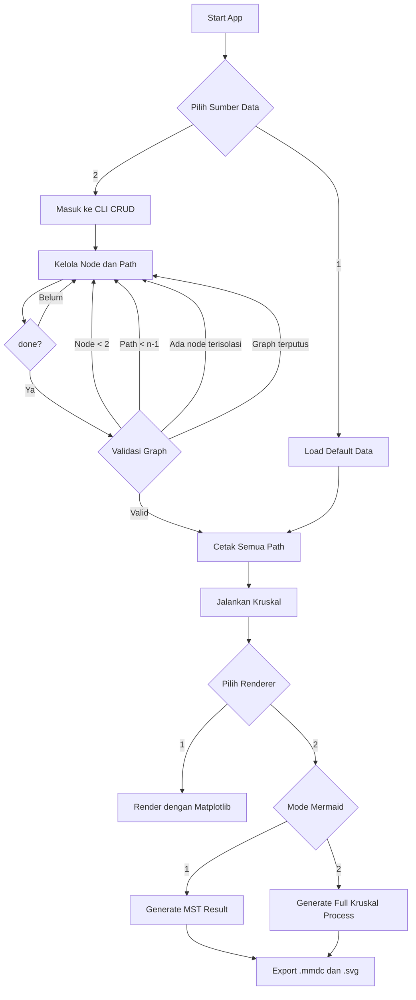

# Minimum Spanning Tree (MST) - Kruskal Algorithm

Project Struktur Data menggunakan algoritma **Minimum Spanning Tree (MST)** dengan metode **Kruskal Algorithm** untuk studi kasus:

> Pemasangan Kabel Internet Antar Daerah

Program ini berjalan di terminal, mendukung input data default atau custom, validasi graph sebelum MST dijalankan, dan output visual menggunakan `Matplotlib` atau `Mermaid`.

---

# Features

- Implementasi algoritma Kruskal
- CLI CRUD untuk node dan path
- Data default untuk demo cepat
- Input graph custom dari terminal
- Rename node dan ubah judul graph
- Validasi duplicate path
- Validasi self-loop
- Validasi node terisolasi
- Validasi graph terputus sebelum MST dijalankan
- Visualisasi MST dengan `NetworkX` + `Matplotlib`
- Export Mermaid flowchart via `mmdc`
- Mode Mermaid:
  - hasil MST saja
  - seluruh proses Kruskal

---

# Dependencies

## Python

Library Python yang dipakai:

- `networkx`
- `matplotlib`
- `termaid`

Install dengan:

```bash
pip install networkx matplotlib termaid
```

Catatan:

- `termaid` saat ini belum menjadi renderer utama aplikasi, tetapi sudah menjadi dependency proyek terkait eksperimen Mermaid di terminal.

## Node / Mermaid CLI

Untuk export Mermaid menjadi SVG:

- `@mermaid-js/mermaid-cli`
- `npm`

Install dengan:

```bash
npm install -g @mermaid-js/mermaid-cli
```

Catatan:

- command yang digunakan aplikasi adalah `mmdc`
- hasil Mermaid disimpan ke folder `result-mmdc`

---

# Installation

## Clone Repository

```bash
git clone <repository-url>
cd <repository-folder>
```

## Install Python Dependency

```bash
pip install networkx matplotlib termaid
```

## Install Mermaid CLI

```bash
npm install -g @mermaid-js/mermaid-cli
```

---

# Run Program

```bash
python main.py
```

---

# App Flow

Berikut flowchart singkat cara kerja aplikasi:



---

# Menu Awal

Saat program dijalankan:

```text
1. Gunakan data default
2. Input data sendiri
```

Flow setelah MST selesai:

```text
1. Pyplot
2. Mermaid / termaid
```

Jika memilih Mermaid:

```text
1. Hasil MST saja
2. Seluruh proses Kruskal
```

---

# Custom CLI Commands

Command utama pada mode custom input:

```text
help
clear
show
title <graph title>
node list
node <count>
node <label>
node <label1,label2,...>
node <count> <label1,label2,...>
node name <id> <label>
node remove <id>
node remove <id1,id2,...>
add <node1> <node2> <distance>
edit <node1> <node2> <distance>
remove <node1> <node2>
done
exit
```

Contoh:

```text
node 5
node Jakarta,Bandung,Bekasi
node name 4 Depok
add Jakarta Bandung 10
edit Jakarta Bandung 7
show
done
```

Gunakan quote untuk label dengan spasi:

```text
node "Jakarta Selatan"
node name 3 "Jakarta Barat"
add "Jakarta Selatan" Bekasi 12
```

---

# Validation Rules

Mode custom input memiliki validasi berikut:

- node minimal `2`
- distance harus lebih besar dari `0`
- duplicate path tidak diperbolehkan
- `1 2` dan `2 1` dianggap path yang sama
- self-loop tidak diperbolehkan
- minimal path harus terpenuhi: `n - 1`
- tidak boleh ada node tanpa path sama sekali
- graph harus terhubung penuh sebelum `done`

Artinya, `done` hanya akan berhasil jika MST benar-benar bisa mencakup seluruh node.

---

# Visualization

## Pyplot

Renderer `Pyplot` menggunakan:

- `NetworkX`
- `Matplotlib`

Aturan visual:

- edge MST: solid
- edge non-MST: dashed gray

## Mermaid

Renderer `Mermaid` membuat file:

- `result-mmdc/{timestamp}.mmdc`
- `result-mmdc/{timestamp}.svg`

Mode Mermaid:

- `result`
  - hanya graph hasil MST
- `process`
  - base graph
  - sorted path
  - step-by-step Kruskal
  - step cycle diberi label `- CYCLE`
  - step akhir MST diberi label `- MST`

Catatan:

- fitur Mermaid saat ini masih dalam tahap pengembangan lanjutan
- jika `mmdc` gagal, aplikasi akan menampilkan error render

---

# Example

## Input

```text
node 3 Jakarta,Bandung,Bekasi
add Jakarta Bandung 10
add Jakarta Bekasi 5
add Bandung Bekasi 7
done
```

## Output

```text
Total Minimum Distance = 12
```

---

# Project Structure

Struktur utama proyek saat ini:

```text
main.py
mst_app/
  app.py
  cli.py
  cli_view.py
  graph_data.py
  graph_session.py
  mst.py
  mermaid_renderer.py
  node_cli.py
  path_cli.py
  ui.py
result-mmdc/
```

---

# Technologies

- Python
- NetworkX
- Matplotlib
- Mermaid CLI (`mmdc`)
- npm
- termaid

---

# Anchor
PPT: https://docs.google.com/presentation/d/1WiyUvd3JOPOmpz-lq5TqilmhV6dn6LU-6QE0d1QPBw8/edit?slide=id.p3#slide=id.p3

---

# Author

Project Struktur Data - Minimum Spanning Tree (MST)

